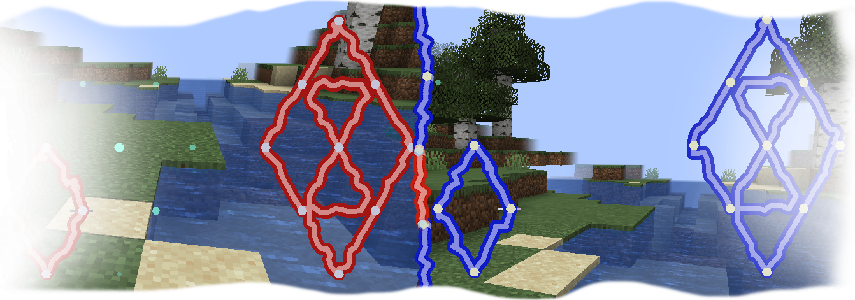
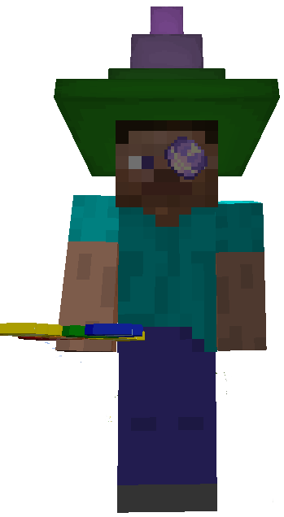
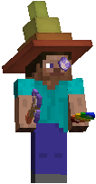
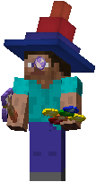

# What ?
It add more pigment related stuffs.

# Pigmented Grid
Your current pigment color now affect your casting grid.
Wow, that's cool. So colorful!

# Pigmented Hat
Your current pigment color now affect your hat.

Wow that's cool. So colorful!

# The cool hat
-*Wow where did you get that cool hat?*

-*I got it from the mod Colorful Hex. You should try it out!*

-*Thanks you! I'm so much cooler now! That's cool. So colorful!*

# Incompatibility
Probably incompatible with Hexlink until I remove the grid color from it.